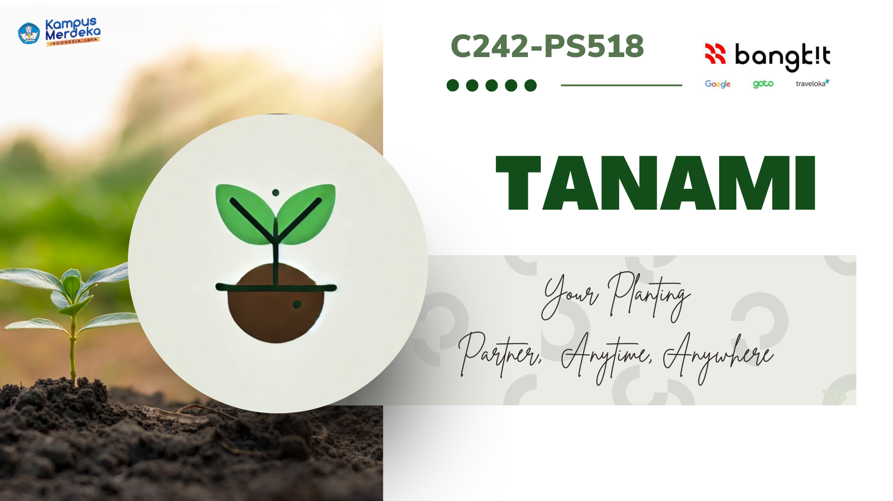
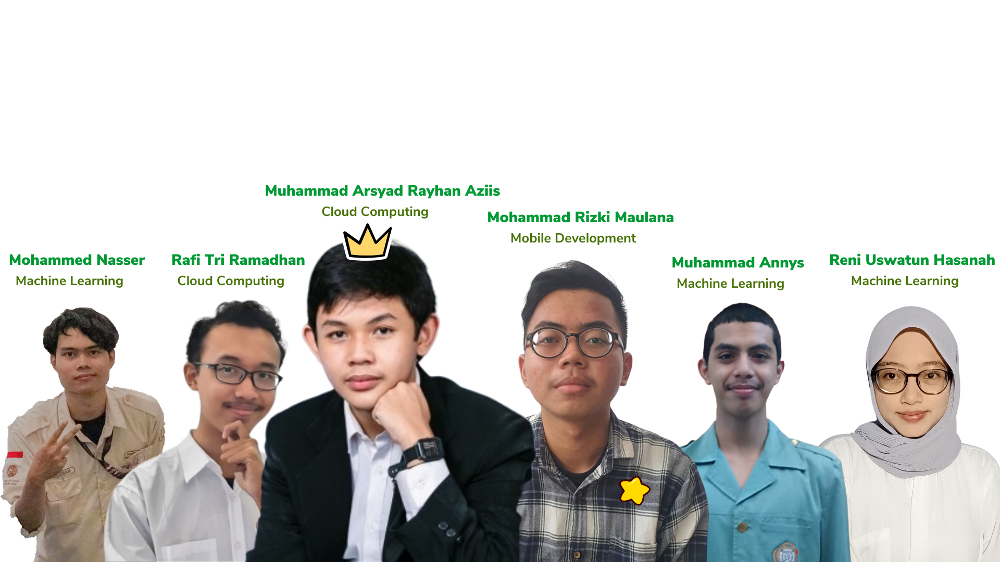

# ✨Tanami: Land Utilization and Healthy Lifestyle | Bangkit Academy 2024 ✨

---

## 🙋‍♀️ About

### 🌱 **Welcome to Tanami!** 🌱

Tanami is more than just an app, it's a movement to raise awareness about the power of fiber and healthy living. Our mission is to encourage users to grow their own plants, foster a deeper connection with their food and promote productive habits for the surrounding community.

By utilizing **unused land** and turning it into productive garden land, Tanami helps everyone to take charge of their nutrition and health, while still taking care of the environment. 🌍✨

#### Tanami's Main Objectives:

- Raise awareness about the benefits of fiber and nutritious food grown at home
- Empowering people to grow their own plants and live healthier lives
- Create a supportive community where users can share experiences and inspire each other

**Together, we can build a healthier and more sustainable future.** 🌿💪

## ⚙️ Features

- **_Soil Identification_** – Scans and identifies soil types using image recognition.
- **_Plant Recommendation_** – Suggests plants based on soil and environmental conditions.
- **_Activity Sharing_** – Lets users share progress and experiences.

## 📖 Usage

1. Download the app and create your account [here](https://github.com/capstone-Tanami/tanami-md/blob/main/tanami.apk) 🌱
2. Scan or manually input your soil type 🪴
3. Share your progress and ask questions 🌍🤔

## 🧑‍🤝‍🧑 Market

Tanami targets urban communities and individuals interested in sustainable living, focusing on:

- People aged 15-70 who want to **learn gardening and enjoy homegrown food**.
- Individuals with **small land spaces** looking to cultivate crops.
- Those seeking to **improve their fiber** intake by growing their own produce.

## 🔮 Plan for the Future

We're always improving Tanami to make gardening easier and more fun. Check out the exciting features coming soon:

- **🌱 Gardening Challenges**: Host events and challenges where the best gardeners win prizes.
- **🤖 AI Integration**: Implement Vertex AI and chatbots for personalized gardening assistance.
- **💧 Plant Care Reminders**: Automated watering and fertilizing notifications.
- **💬 Community Engagement**: Add follow, like, and comment features for sharing progress.
- **🛒 Marketplace Integration**: Partner with Tanami.co.id for seamless online plant tool purchases.
- **🌿 Expanded Plant Database**: Add more plant datasets for better recommendations.
- **🏷️ Checkout System**: Allow users to directly purchase gardening tools and supplies from within the app.

## 🌈 GitHub Friends

I appreciate my amazing team! This is my team:

| Id Members   | Name Members                     | Learning Path       | GitHub Profile                                       |
| ------------ | -------------------------------- | ------------------- | ---------------------------------------------------- |
| A312B4KY2580 | **Mohammad Rizki Maulana**       | Mobile Development  | [@rizkimaulana32](https://github.com/rizkimaulana32) |
| M312B4KY2585 | **Mohammed Nasser**              | Machine Learning    | [@Monashr](https://github.com/Monashr)               |
| M312B4KY2730 | **Muhammad Annys**               | Machine Learning    | [@Swordigo15](https://github.com/Swordigo15)         |
| C312B4KY2747 | **Muhammad Arsyad Rayhan Aziis** | Cloud Computing     | [@Menghantui](https://github.com/SiHantuuu)          |
| C312B4KY3588 | **Rafi Tri Ramadhan**            | Cloud Computing     | [@RafiTri](https://github.com/RafiTri)               |
| M312B4KX3751 | **Reni Uswatun Hasanah**         | Project Maintainers | [@Areen](https://github.com/ReniUswatun)             |

---

**_Present by C242-PS518_**
